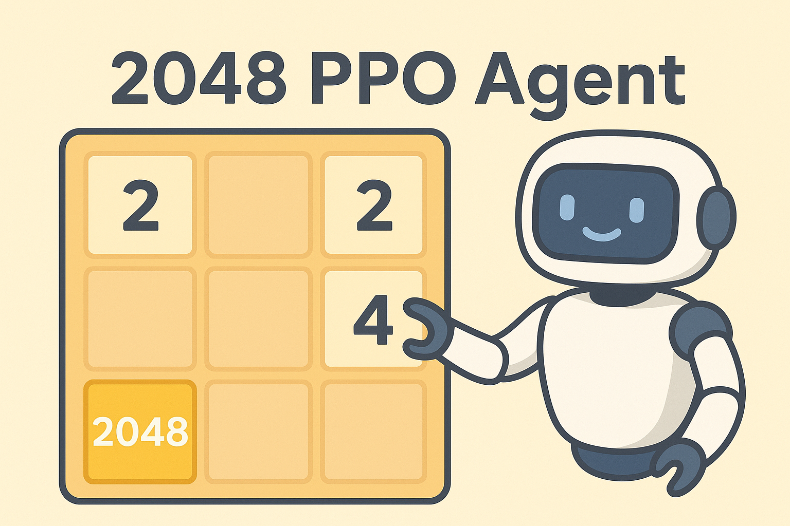
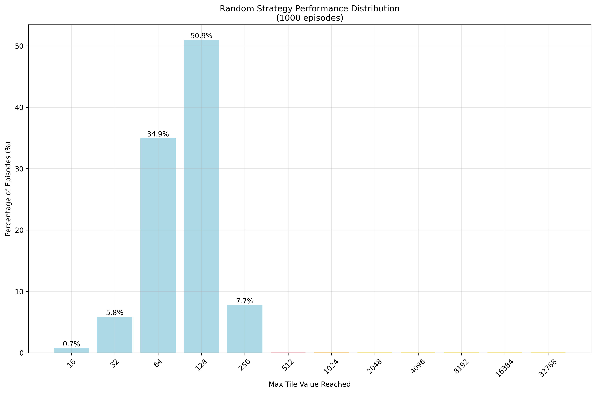
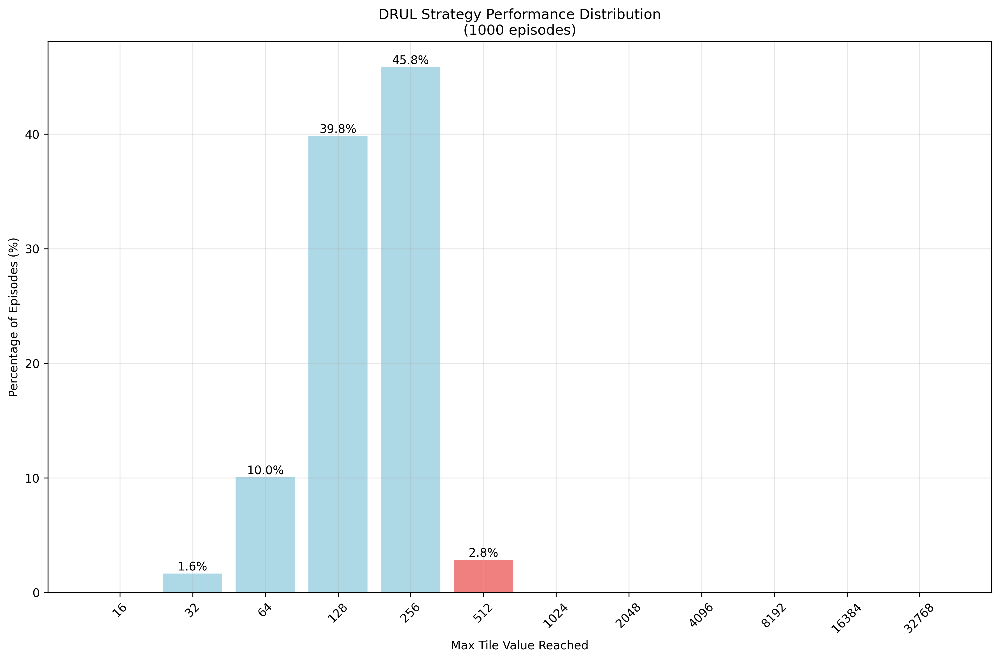
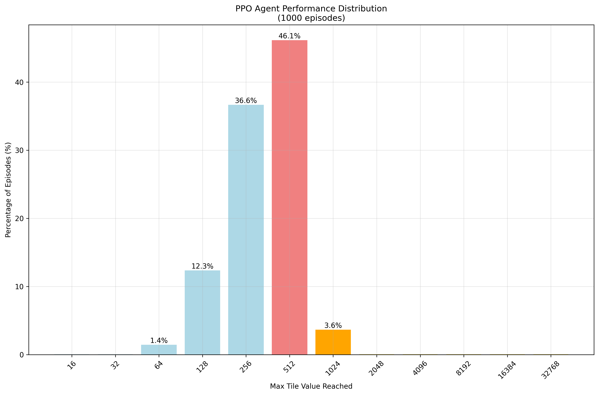

# 2048-ppo-agent


A proximal policy optimization (PPO) reinforcement learning (RL) agent for the game 2048.

<div align="center">
<figure>

</figure>
</div>

## Introduction
This project is a reinforcement learning agent that uses the proximal policy optimization (PPO) algorithm to learn how to play the game 2048. The agent is implemented in Python using the PyTorch library. The gameplay environment leverages the Pgx library which is built with JAX
allowing for fast computation on GPUs.

## Motivation
The original motivation behind this project was to test out Python packages that bridge JAX and PyTorch since a 
lot of RL environments are being built in JAX, while most of my modeling experience is in PyTorch.
I did not want to have to learn JAX in depth, so this project serves as a way to experiment with JAX-based environments 
while leveraging my existing PyTorch knowledge, especially my experience with Transformers.
Additionally, I wanted to implement PPO from scratch to gain a deeper understanding of the algorithm.

After starting this project, I left it for a while but recently returned to continue the work. In order
to keep momentum, I also started leveraging AI coding assistants to help with code generation and exploration.
This is one of my first projects where I have let AI take a lot of the responsibility for implementing features 
while I focused on higher-level design and experimentation. Through this process, I have found that while
the AI assistant allows you to rapidly create a lot of code, it still requires human oversight and direction
to ensure that the code is correct and functions as intended. I did end up having to spend a significant amount
of time fixing small bugs and issues that arose from the generated code. The most frustrating part is that
the bugs are subtle and the code seems to run as intended without error.

## Getting Started
To get started, clone the repository and install the required dependencies with uv using the following commands:
```bash
git clone https://github.com/michaelriedl/2048-ppo-agent.git
cd 2048-ppo-agent
uv sync
```

You can then run any scripts or notebooks with the `.venv` environment activated.
```bash
source .venv/bin/activate
```

## Naive Strategies
Before training the PPO agent, I implemented a few naive strategies to serve as baselines for comparison. 
These strategies include:
1. **Random Agent**: The random agent makes a random move at each step.
2. **Corner (DRUL) Agent**: The corner agent always prioritizes the moves in the order: Down, Right, Up, Left.

These srategies are explored in the notebook `notebooks/explore_naive_strategies.ipynb`. Some
visualizations of the strategies are shown below.

### Random Agent Visualization
<div align="center">
<figure>

</figure>
</div>

### Corner Agent Visualization
<div align="center">
<figure>

</figure>
</div>

## PPO Agent Results

### Gameplay Visualization
<div align="center">
<figure>

</figure>
</div>

### Performance Comparison
<div align="center">
<figure>

</figure>
</div>

<div align="center">
<figure>

</figure>
</div>

<div align="center">
<figure>

</figure>
</div>


## References
Below are some references that were helpful in the development of this project:

1. [2048 Reinforcement Learning](https://github.com/mrTSB/2048-reinforcement-learning)
2. [ML2048](https://github.com/tsangwpx/ml2048)
3. [PPO-PyTorch](https://github.com/nikhilbarhate99/PPO-PyTorch)
4. [torch2jax](https://github.com/samuela/torch2jax)
5. [Pgx](https://github.com/sotetsuk/pgx)